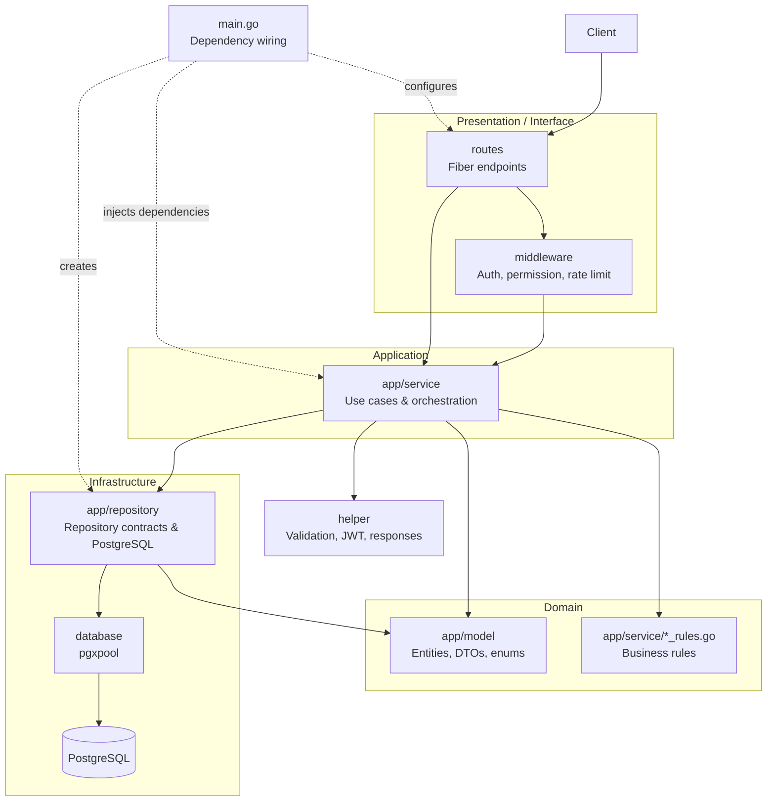

# PiiBL E-Commerce REST API

REST API e-commerce multi-store berbasis Go. Customer dapat checkout produk dari beberapa toko dalam satu transaksi; Tenant mengelola toko, katalog, varian, stok, dan pesanan tokonya. Proyek ini dikembangkan sebagai tugas kuliah Backend Lanjut.

## Fitur

- Registrasi, login, JWT access token, refresh token, dan kontrol akses berbasis role/permission.
- Katalog toko dan produk, termasuk variant space dan product variant.
- Checkout multi-store tanpa cart persisten di backend.
- Validasi varian dan perhitungan harga di server.
- Pengurangan stok atomik dan penyimpanan order dalam satu transaksi database.
- Daftar order dengan filter status dan ekspor CSV; akses dibatasi sesuai kepemilikan.
- Snapshot `OrderItem` menjaga detail pembelian dari perubahan katalog di kemudian hari.

## Arsitektur

Struktur proyek menerapkan pemisahan layer bergaya Clean Architecture: handler HTTP bergantung pada service, service menggunakan model/domain rules dan kontrak repository, sedangkan implementasi repository menangani PostgreSQL.



### Struktur Direktori

| Path | Tanggung jawab |
|---|---|
| `app/model/` | Entity, request/response model, enum, dan tipe domain |
| `app/service/` | Use case HTTP, orkestrasi, validasi kepemilikan, serta aturan domain |
| `app/repository/` | Kontrak repository dan query/transaksi PostgreSQL |
| `routes/` | Pendaftaran endpoint dan middleware per endpoint |
| `middleware/` | Autentikasi, permission, rate limiter, dan middleware umum |
| `helper/` | Validator, JWT, parsing query, negosiasi format, dan response/error |
| `database/` | Pembuatan dan pengelolaan connection pool PostgreSQL |
| `migrations/` | Skema dan perubahan database SQL berurutan |

## Roles

| Role | Akses utama |
|---|---|
| Guest | Melihat toko dan produk aktif |
| Customer | Checkout serta melihat order dan review yang menjadi haknya |
| Tenant | Mengelola satu toko, katalog, stok, dan order tokonya |
| Admin | Operasi administratif sesuai permission yang diberikan |

## Aturan Produk dan Checkout

- Setiap produk memiliki variant khusus `_default` sebagai harga dasar.
- Harga akhir dihitung sebagai `harga dasar + adjustment` semua varian yang dipilih; harga minimum adalah IDR 100.
- Setiap variant space wajib hanya mengizinkan satu pilihan. Semua space wajib harus dipilih saat checkout.
- Stok disimpan di produk, bukan di kombinasi varian.
- Checkout menggabungkan item berdasarkan toko dan membuat satu order per toko.
- Update stok dan pembuatan order memakai satu transaksi; kuantitas per produk dikunci secara kondisional untuk mencegah overselling.
- Status order dimulai dari `CREATED`; Tenant pemilik toko dapat mengubahnya ke `COMPLETED` atau `CANCELLED`. Kedua status akhir bersifat terminal.
- Pembatalan tidak mengembalikan stok secara otomatis.

Seluruh nominal disimpan sebagai integer dalam IDR, misalnya `50000` berarti Rp50.000. Cart tidak disimpan oleh backend; klien mengirim item checkout langsung.

## Teknologi

- Go 1.26.5 dan Fiber v2
- PostgreSQL melalui `pgx`/`pgxpool`
- JWT, bcrypt, dan `go-playground/validator`

## Menjalankan Secara Lokal

1. Siapkan Go dan PostgreSQL.
2. Buat database, lalu terapkan file `migrations/*.sql` berurutan menurut nomor. Migration dijalankan terpisah dan tidak diterapkan otomatis saat aplikasi mulai.
3. Salin `.env.example` menjadi `.env`, lalu isi konfigurasi database dan JWT. `JWT_SECRET` harus sekurangnya 32 karakter; jangan gunakan secret contoh di luar lingkungan lokal.
4. Pastikan file password umum tersedia pada `PW_COMMON_PATH` (default: `./files/common_password.txt`).
5. Jalankan aplikasi:

   ```sh
   go run .
   ```

Port bawaan adalah `3000`. Health check: `GET /api/v1/health`.

Contoh isi `.env` untuk pengembangan lokal:

```dotenv
APP_NAME="piibl-e-commerce"
APP_PORT=3000

PW_COMMON_PATH="./files/common_password.txt"

DB_HOST=localhost
DB_PORT=5432
DB_USER=postgres
DB_PASSWORD=change-me
DB_NAME=piibl_ecommerce
DB_SSLMODE=disable
DB_MAX_CONNS=10

LOG_LEVEL=info

# Ganti dengan secret acak minimal 32 karakter.
JWT_SECRET="replace-with-a-random-secret-of-at-least-32-chars"
JWT_ISSUER="piibl-e-commerce"
JWT_ACCESS_TTL_MINUTES=15
JWT_REFRESH_TTL_DAYS=7

ALLOWED_ORIGINS="http://localhost:5173"
```

### Konfigurasi Lingkungan

| Variable | Fungsi |
|---|---|
| `APP_PORT` | Port HTTP, default `3000` |
| `DB_HOST`, `DB_PORT`, `DB_USER`, `DB_PASSWORD`, `DB_NAME` | Koneksi PostgreSQL |
| `DB_SSLMODE`, `DB_MAX_CONNS` | SSL dan batas koneksi pool |
| `JWT_SECRET`, `JWT_ISSUER` | Penandatanganan dan issuer token |
| `JWT_ACCESS_TTL_MINUTES`, `JWT_REFRESH_TTL_DAYS` | Masa berlaku token |
| `PW_COMMON_PATH` | Daftar password umum untuk validasi |
| `ALLOWED_ORIGINS` | Origin yang diizinkan CORS |
| `LOG_LEVEL` | Level logging |

Verifikasi lokal:

```sh
go build ./...
go test ./...
```

## Ringkasan Endpoint

Semua endpoint berada di bawah `/api/v1`. Endpoint terlindungi menerima:
`Authorization: Bearer <access-token>`.

| Area | Endpoint utama |
|---|---|
| Auth | `POST /auth/register`, `POST /auth/login`, `POST /auth/refresh`, `POST /auth/logout`, `GET /auth/me` |
| Users | `/users` dan `/users/:id` untuk operasi akun/role sesuai permission |
| Stores | `/stores`, `/stores/:id`, `GET /my/stores` |
| Products | `/products`, `/products/:id`, `GET /my/products`, `PATCH /products/:id/stock`, `PATCH /products/:id/price` |
| Variant spaces | `POST /products/:id/variant-spaces`, `PATCH/DELETE /variant-spaces/:id` |
| Variants | `POST /variants`, `PATCH/DELETE /variants/:id` |
| Orders | `POST /orders/checkout`, `GET /orders`, `GET /orders/:id`, `PATCH /orders/:id/status` |

Daftar endpoint order hanya menampilkan order milik Customer yang login atau order dari toko Tenant yang login. `GET /orders` mendukung `order_status`, pagination `page`/`limit`, serta `Accept: text/csv`; format default adalah JSON.

Respons JSON menggunakan envelope umum:

```json
{
  "success": true,
  "message": "Pesan hasil operasi",
  "data": {}
}
```

Dokumentasi request, response, permission, dan kode status per endpoint tersedia di [laporan proyek](logs/laporan_project.md).

## Di Luar Cakupan

Payment gateway, alamat dan pengiriman, retur/refund, chat, penyimpanan gambar, notifikasi, persistent cart, dan idempotensi belum termasuk.

## Status

✅ **Selesai untuk ruang lingkup saat ini** — proyek telah menyelesaikan kebutuhan yang ditetapkan, namun tetap terbuka untuk pengembangan dan penyempurnaan lebih lanjut.
